<div align="center">



<br>

<a href="https://x.com/Ex0_Byte"></a>
<a href="https://ko-fi.com/terrabyte1000"></a>
<a href="https://www.patreon.com/cw/Ex0_Byte"></a>
<a href="https://buymeacoffee.com/ex0_byte"></a>

</div>

```text
root@blackhatshiftey:~# ./profile --init

identity      BlackhatShiftey
role          AI Architect
stack         Python | automation | agentic workflows | security tooling
mission       Build practical systems that make complex work faster, cleaner, and harder to break.
status        Designing, testing, and shipping useful tools.
```

I build AI-assisted systems, automation workflows, and security-minded developer tools. My lane is where Python, agents, infrastructure, and defensive automation overlap.

<div align="center">
  
</div>

## Operator Dashboard

| Signal | Focus |
| --- | --- |
| AI systems | Agent workflows, model-assisted tooling, MCP-style integrations, local-first automation |
| Python automation | Scripts, CLIs, data pipelines, workflow orchestration, repeatable operations |
| Security automation | Recon helpers, validation workflows, hardening checks, practical defensive tooling |
| Full-stack builds | React, Node, APIs, dashboards, docs, deployment surfaces |

## Current Focus

- Building cleaner AI workflows that help with real engineering work.
- Automating repetitive security and development tasks with Python.
- Turning rough ideas into tools, dashboards, and repo-ready projects.
- Keeping the signal high: useful systems, working links, readable docs.

<div align="center">
  
</div>

## Core Stack

<div align="center">


</div>

## Build Pattern

```text
idea
  -> threat model the weak points
  -> automate the boring path
  -> ship a small working version
  -> test what breaks
  -> document the useful parts
```

<div align="center">
  
</div>

## GitHub Telemetry

<div align="center">


<br>


</div>

## Support The Work

If something here helps you build, automate, or learn, support keeps the lab running.

<div align="center">

<a href="https://ko-fi.com/terrabyte1000"></a>
<a href="https://www.patreon.com/cw/Ex0_Byte"></a>
<a href="https://buymeacoffee.com/ex0_byte"></a>

</div>

## Contact

- X: [@Ex0_Byte](https://x.com/Ex0_Byte)
- GitHub: [BlackhatShiftey](https://github.com/BlackhatShiftey)
